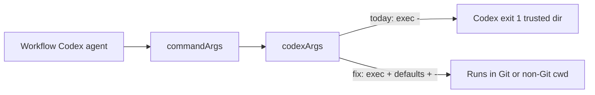

# Fix Codex trusted-directory workflow failure

## Architectural clarification

A Codex agent here is a **general-purpose workflow node**, not necessarily a repository coding agent.

Valid executions include ordinary non-Git workspaces, e.g.:

```text
prompt: "hi"
workspace: ordinary non-Git directory
```

Also valid: planning, reasoning, task analysis, text generation, and other work that does not need a Git repository.

Therefore:

- Do **not** treat absence of `.git` as a malformed workspace
- Do **not** require `git rev-parse --show-toplevel`
- Do **not** auto-create Git repositories
- Do **not** push flag injection into workflow definitions or every agent’s Arguments UI

The runtime must abstract away Codex CLI’s Git-repository / trusted-directory requirement for headless `exec`.

## Root cause

[`codexArgs()`](src/agents/runtime/cliAgentExecutor.ts) currently builds only `["exec", ...explicit, "-"]`. With empty agent args that is `codex exec -`.

Codex then exits:

```text
Not inside a trusted directory and --skip-git-repo-check was not specified.
```

This is especially common in container mode: cwd is `/workspace`, and `CODEX_HOME` is a fresh disposable worker home with no persisted trust list. E2E agents work only because they hardcode the flags; default/UI agents do not.

Claude already centralizes a container-only default in `claudeArgs(..., allowPermissionBypass)`. Codex needs the same centralized policy.



## Approach

Update only [`src/agents/runtime/cliAgentExecutor.ts`](src/agents/runtime/cliAgentExecutor.ts):

1. Pass `workerMode` into `codexArgs` the same way `commandArgs` already passes it into `claudeArgs`.
2. **All Codex headless executions** (local + container): if missing, inject `--skip-git-repo-check`.
   - This is a **backend compatibility default** for non-Git (and untrusted-by-Codex) workspaces.
   - It is **not** disabling Codex’s sandbox/security boundary.
3. **Container mode only**: if missing, also inject `--dangerously-bypass-approvals-and-sandbox` and `--ephemeral`.
   - Rationale: `ContainerWorkerRuntime` already owns the security boundary (non-root, read-only rootfs, dropped caps, no-new-privileges, isolated workspace, temporary home, controlled credentials, cleanup, network policy). Nested Codex approval/sandbox must not block autonomous headless runs; `--ephemeral` avoids session state in a disposable worker.
4. **Local mode**: do **not** auto-inject sandbox bypass (or ephemeral). Keep local security posture.
5. Preserve all explicit agent args; never duplicate auto-managed flags already present.

Effective defaults:

- Local: `codex exec --skip-git-repo-check -`
- Container:

```text
codex exec \
  --skip-git-repo-check \
  --dangerously-bypass-approvals-and-sandbox \
  --ephemeral \
  -
```

Workflow authors must not need to know about `--skip-git-repo-check`.

## Tests

Update/add focused coverage in [`tests/agentExecutor.test.ts`](tests/agentExecutor.test.ts) (and any existing expectations that assert bare `["exec", "--json", "-"]`):

- **Non-Git regression**: workspace without `.git`, `prompt = "hi"`, `backend.args = []` → constructed command contains `--skip-git-repo-check`
- **Local empty args**: `["exec", "--skip-git-repo-check", "-"]` — sandbox bypass absent; `--ephemeral` absent
- **Container empty args**: includes `--skip-git-repo-check`, `--dangerously-bypass-approvals-and-sandbox`, `--ephemeral`
- **Explicit args**: auto-managed flags already present are preserved once (no duplicates); arbitrary user Codex args remain intact
- **Unchanged**: Claude local/container behavior; credential-file auth path; ContainerWorkerRuntime isolation args; local mode not weakened by sandbox bypass

## Operational smoke

After unit tests, run a small real smoke through the normal application/runtime path:

```text
Codex agent
workspace = non-Git directory
prompt = "hi"
```

Must reach Codex without the trusted-directory error. Do **not** `git init` the workspace to make smoke pass.

## Scope (do not)

- Redesign workspace management
- Redesign Codex authentication / Credential Gateway
- Add Git initialization or require repositories
- Change unrelated workflow behavior
- Rely on per-agent Arguments as the primary fix

## Report after implementation

1. Exact `codexArgs()` behavior for local mode
2. Exact behavior for container mode
3. Duplicate handling
4. Tests added/updated
5. Non-Git `"hi"` smoke result
6. Files changed
7. Test/typecheck results
