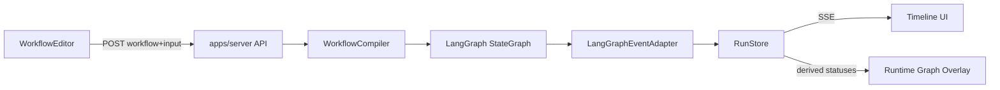

# Phase 4 — Execution Timeline & Live Execution (Real LangGraph Bridge)

## Approach (locked)

```text
WorkflowDefinition (+ agents, input)
        ↓
apps/server WorkflowCompiler  →  StateGraph.compile()
        ↓
RunExecutor (astream / streamEvents)
        ↓
LangGraphEventAdapter  →  RunEvent[]
        ↓
RunStore (append-only) + SSE
        ↓
apps/web Timeline + runtime graph overlay
```

- **No codegen** from the visual editor. Compile definitions in memory at run start.
- **Frontend depends only on** shared `Run` / `RunEvent` / `WorkflowDefinition` types — never LangGraph chunk shapes.
- **Out of scope (as specified):** distributed workers, queues, durable checkpoint recovery, deep pause/resume, advanced HITL, versioning, multi-user collab, replacing Langfuse.

## Executable node policy

| Node type | Phase 4 behavior |
|-----------|------------------|
| `input`, `output`, `agent`, `condition`, `memory` | Compile + execute on real LangGraph path |
| `tool`, `approval` | Allowed in definition; **enter → emit `node.failed` (and `tool.*` / `human_approval.requested` where relevant) with a clear “not supported in Phase 4” error** — no silent simulation |

Agent nodes invoke LLMs using linked [`AgentRecord`](../../apps/web/src/lib/workflow/types.ts) (`model`, `systemPrompt`, tools list ignored until Phase 6). Condition nodes choose a branch from a simple state key / first matching `branchKey` (deterministic, documented). Memory nodes read/write an in-run state bag and emit `memory.read` / `memory.write`.

---

## 1. Shared domain package

Create [`packages/types`](../../packages/types) (pnpm workspace already includes `packages/*`).

**Promote / redefine:**

- `WorkflowDefinition`, `WorkflowNode`, `WorkflowEdge`, `AgentRecord` (move canonical copies here; [`apps/web/src/lib/workflow/types.ts`](../../apps/web/src/lib/workflow/types.ts) re-exports or depends on `@multi-agent/types`).
- **`Run`**: `runId`, `workflowId`, `taskId?`, `status`, `startedAt`, `completedAt?`, `input`, `output?`, `error?`, `currentNodeId?`, `metadata`.
- **`RunEvent`**: `id`, `runId`, `type`, `timestamp`, `nodeId?`, `agentId?`, `toolId?`, `parentEventId?`, `sequence`, `payload`.
- **`RunEventType`** union covering at least:  
  `run.started|completed|failed`, `node.started|completed|failed`, `edge.traversed`, `agent.started|completed|failed`, `tool.started|completed|failed`, `human_approval.requested|resolved`, `memory.read|write`, `log`.
- Run status enum aligned with roadmap (`queued` | `running` | `completed` | `failed` | `cancelled`, plus `waiting_for_human` reserved but unused deeply).

Keep UI-only React Flow types in the web app.

---

## 2. Execution server (`apps/server`)

Scaffold a TypeScript Node app (Hono or Express — prefer **Hono** for lightweight SSE). Wire root scripts: `dev:server`, `dev` runs web + server.

### Layout

```text
apps/server/
  src/
    api/           # HTTP + SSE routes only
    compiler/      # WorkflowDefinition → StateGraph
    runtime/       # RunExecutor, RunStore
    adapters/      # LangGraphEventAdapter
    nodes/         # Per-type LangGraph node handlers
```

Reuse patterns from [`src/agents/core/graphEngine.ts`](../../src/agents/core/graphEngine.ts) (Annotation, `MemorySaver`, `thread_id`) but **do not** hard-code the CLI orchestrator topology. The CLI engine stays as-is for Phase 4; studio runs use the new dynamic compiler.

### Compiler (`compiler/workflowCompiler.ts`)

- Validate definition server-side (start from web [`validation.ts`](../../apps/web/src/lib/workflow/validation.ts) rules; authoritative on server).
- Build a generic runtime state annotation: `input`, `output`, `messages`, `memory` bag, `branchChoices`, `errors`, etc.
- Map each workflow node → named LangGraph node (`node.id` as graph key).
- Wire edges: normal `addEdge`; conditional via `addConditionalEdges` using `branchKey`.
- Attach `START` → unique `input` node(s); `output` → `END`.
- Compile with in-process `MemorySaver` (ephemeral; recovery is Phase 9).

### Runtime (`runtime/runExecutor.ts`)

- `createRun({ workflow, agents, input, taskId? })` → persist Run + emit `run.started`.
- Execute with LangGraph streaming (`streamEvents` and/or `astream` with suitable modes).
- Pass chunks through **`LangGraphEventAdapter`** → append `RunEvent`s to `RunStore`.
- On terminal success/failure: update Run, emit `run.completed` / `run.failed`.
- Cancel: cooperative abort signal; emit `run.failed` or a dedicated cancelled status if already modeled.

### Adapter (`adapters/langGraphEventAdapter.ts`)

Sole place that understands LangGraph event names/payloads. Maps to Studio `RunEvent`s (`node.*`, `agent.*` for agent-typed nodes, `edge.traversed` when routing is observable, `log` for informational). Strip secrets from payloads.

### Persistence (Phase 4 scope)

In-memory `RunStore` (Map) holding Run + ordered events. Enough for live SSE + reopen while process is up. Optional JSON file under `.data/runs/` if useful for local reopen across soft reloads — not durable recovery.

### API

| Method | Path | Purpose |
|--------|------|---------|
| `POST` | `/runs` | Body: `{ workflow, agents, input, taskId? }` → `{ runId }` |
| `GET` | `/runs/:runId` | Run snapshot |
| `GET` | `/runs/:runId/events` | SSE: replay buffered events, then live appends; heartbeat; support `Last-Event-ID` / `sequence` for reconnect |
| `POST` | `/runs/:runId/cancel` | Best-effort cancel |

CORS for `apps/web` origin. Env: `PORT`, LLM keys (reuse root `.env` patterns).

---

## 3. Web: services, store, transport

- Env: `NEXT_PUBLIC_EXECUTION_API_URL` (default `http://localhost:4000`).
- [`runService.ts`](../../apps/web/src/services/runService.ts): `startRun`, `getRun`, `cancelRun`.
- [`createRunEventStream(runId)`](../../apps/web/src/services/runEventStream.ts): EventSource wrapper — reconnect with backoff, surface `connecting` / `live` / `error` / `closed`, expose events via callback/store. **Abstract transport** so WS can replace SSE later without Timeline rewrites.
- Zustand [`useRunStore`](../../apps/web/src/store/useRunStore.ts): current run, ordered events, derived `nodeRuntimeStatus: Record<nodeId, running|completed|failed|idle>`, selection, autoScroll flag.
- Keep workflow save on client localStorage for Phase 4; **POST sends full definition** to the server at start (no requirement that server owns workflow persistence yet).

---

## 4. Execution Timeline UI + graph sync

### Routes / entry points

- Add **Run** control on editor toolbar ([`EditorToolbar.tsx`](../../apps/web/src/components/workflow/EditorToolbar.tsx)): validate → `startRun` with current workflow + agents + prompt → navigate to `/runs/[runId]`.
- Page [`apps/web/src/app/(authenticated)/runs/[runId]/page.tsx`](../../apps/web/src/app/%28authenticated%29/runs/%5BrunId%5D/page.tsx): split layout — **read-only graph** (reuse React Flow mapping from [`FlowCanvas.tsx`](../../apps/web/src/components/workflow/FlowCanvas.tsx) without mutating editor store) + **Timeline panel**.
- Nav links from dashboard / org / tasks → Runs when a runId exists.

### Timeline panel requirements

- Chronological list from `RunEvent` (not LangGraph shapes).
- Live SSE updates; preserve list after `run.completed` / `run.failed`.
- Status badges; node/agent/tool labels resolved from workflow + agents.
- Select event → detail/payload inspector (sanitized JSON).
- Auto-scroll while live; disable on manual scroll; “Jump to latest” restores auto-scroll.
- Connection banner for SSE error/reconnect.

### Graph overlay

- Separate **runtime view state** from design store ([`useWorkflowStore`](../../apps/web/src/store/useWorkflowStore.ts) unchanged for saved definition).
- Highlight: active → running, finished → completed, errored → failed (style in [`WorkflowNodes.tsx`](../../apps/web/src/components/workflow/nodes/WorkflowNodes.tsx) via status prop / class).
- Do not write runtime status into persisted workflow JSON.



---

## 5. Tests & docs

- **Unit:** compiler (topology, conditional edges, unsupported node failure), adapter mapping fixtures, RunEvent sequencing.
- **Integration:** start run with a minimal `input → agent → output` definition (LLM mocked), assert SSE emits `run.started` → `node.*` → `run.completed`.
- Update the current status in [`docs/roadmap.md`](../../docs/roadmap.md) when DoD is met; keep the architecture note that Phase 4 introduced `apps/server` + `packages/types`.

---

## Definition of Done (Phase 4)

A user can save a workflow in the editor, start a run, watch the Timeline update over SSE from real LangGraph execution, see graph node statuses update from `RunEvent`s, inspect event payloads, reconnect the stream, and reopen the same run’s timeline for the process lifetime — with the frontend never importing LangGraph.
